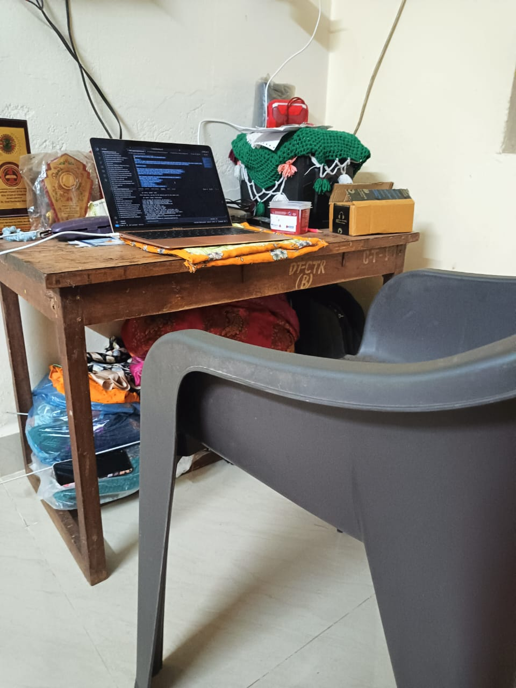

# Occupational Health & Safety (OHS) for Desk-Based Work

## Overview
This task is about understanding how to set up a comfortable and safe workstation, especially when using a laptop. Since most of my work is desk-based, having good ergonomics helps prevent strain, pain, and fatigue.

---

## Research & Learn

### What are the risks of using a laptop without an external monitor or keyboard?
Using only a laptop often forces me to bend my neck down and hunch my shoulders.  
This can cause neck strain, back pain, wrist discomfort, and eye fatigue.  
Long-term, it can lead to posture issues.

---

### What ergonomic equipment can improve posture when working on a laptop?
Equipment that helps includes:
- A laptop stand to raise the screen  
- An external keyboard and mouse  
- An ergonomic chair  
- A cushion or footrest  
- A larger monitor for better visibility  

---

### What adjustments should be made to monitor height, chair position, and desk setup for a healthier workspace?
- The top of the monitor should be at eye level  
- Chair height should allow feet to sit flat on the floor  
- Shoulders should remain relaxed and wrists straight  
- The screen should be positioned at arm’s length to reduce eye strain  

---

### What are some daily habits that reduce the impact of prolonged laptop use?
Helpful habits include:
- Taking movement breaks every 30–45 minutes  
- Doing regular posture checks  
- Following the 20–20–20 eye rule  
- Stretching hands, neck, and shoulders  
- Avoiding long periods of sitting without changing position  

---

## Reflection

### What equipment changes can you make to improve your workspace setup?
I don’t have an adjustable chair, so I use my study table to set up the laptop at a comfortable height.  
I added a small stand (and sometimes a book under the laptop) to raise the screen, which reduces strain on my neck.

---

### What behavioural changes can you implement to improve posture and reduce strain?
I try to sit upright, keep my back supported by the chair, and avoid bending forward.  
I also take more frequent breaks so my neck and shoulders don’t become stiff.

---

### How can you remind yourself to maintain good posture and take breaks throughout the day?
I use Focus Bear movement reminders and set short posture alerts.  
These help me stay aware of my posture even during long work sessions.

---

## Task

### Adjust your laptop setup based on ergonomic best practices
I raised the laptop on my study table using a stand and books and positioned it so I don’t have to bend my neck excessively.

---

### Identify at least one piece of equipment that could improve your posture and comfort
A laptop stand helps the most, and I plan to get an external keyboard when possible.

---

### Try using posture and movement reminders for a full workday and note any improvements
Using reminders helped reduce shoulder tension and encouraged more frequent movement.

---

### Document at least one workspace change or habit adjustment you made
I adjusted the laptop height on my table and started taking breaks every 45 minutes.

---

## Workspace Setup Evidence

### Current Desk Setup After Ergonomic Adjustments

**Description:**  
This photo shows my current desk-based workspace after making ergonomic improvements. I raised my laptop using a books so the screen is closer to eye level, reducing the need to bend my neck. I work at a table with a stable sitting position and take regular posture and movement breaks.

**Ergonomic Adjustments Made:**
- Laptop raised to improve screen height  
- Reduced neck bending by adjusting screen position  
- Regular posture and movement breaks during desk-based work  
