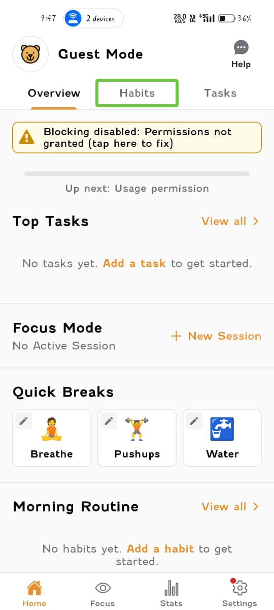
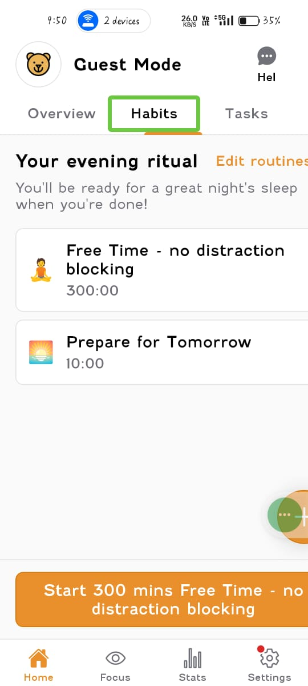

# Accessibility Testing – Focus Bear App (Android)

**App Name:** Focus Bear: AuDHD routines  
**Platform:** Android  
**App Version:** 1.14.0  
**Device Tested:** Realme Narzo 50 Pro (RMX3395)  
**Android Version:** Android 14  
**Testing Type:** Manual Accessibility Testing  

---

## Overview

This document provides evidence of accessibility testing performed directly on the Focus Bear Android app. The testing focused on screen reader support, basic navigation, and accessibility-related usability for users with assistive needs.

---

## Accessibility Testing 

### Test 1: Screen Reader (TalkBack) Navigation

**Steps Performed:**
- Enabled TalkBack from Android Accessibility settings
- Opened the Focus Bear app
- Navigated through onboarding screens and main habit screens using swipe gestures

**Observation:**
- Most buttons and interactive elements were announced correctly
- Screen reader focus moved logically between elements

**Issue Found (Minor):**
- Some descriptive labels could be more explicit (e.g., generic button names)

---

### Test 2: Focus Navigation & Touch Targets

**Steps Performed:**
- Navigated the app using TalkBack gestures only
- Tested habit creation and navigation without relying on visual cues

**Observation:**
- Primary actions were reachable using accessibility navigation
- Touch targets were generally large enough for accessibility use

**Result:**
- No major navigation blockers found

---

### Test 3: Text Size & Contrast Check

**Steps Performed:**
- Increased system font size from Android accessibility settings
- Reopened the Focus Bear app and navigated key screens

**Observation:**
- Text scaled correctly without overlapping UI elements
- Content remained readable at larger text sizes

**Result:**
- No major text or contrast accessibility barriers observed

## Accessibility Findings Summary

- Screen reader support is mostly functional
- App is usable with TalkBack enabled
- No critical accessibility blockers were found during testing
- Minor improvements could be made to descriptive labels for better clarity

---

## Conclusion

Accessibility testing was performed directly on the Focus Bear Android app using TalkBack and system accessibility settings. The app is generally accessible for screen reader users, with no major barriers identified. Minor enhancements could further improve clarity and usability for users relying on assistive technologies.
