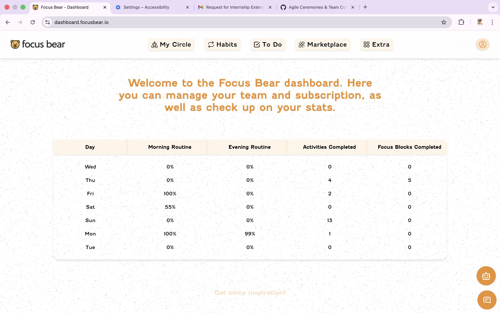

# Understanding Focus Bear’s Mission and Vision

## Overview

To understand Focus Bear’s mission and vision, I explored the official Focus Bear website and reviewed the product features, descriptions, and use cases. I focused on how the app helps users improve focus, build healthy routines, and reduce distractions.

---

## Focus Bear’s Mission

From exploring the website, I understand that Focus Bear’s mission is to help people stay focused and productive while building better daily habits. The app is designed to support users in reducing distractions, maintaining consistency, and improving mental well-being.

Unlike simple to-do or blocker apps, Focus Bear combines productivity with habit-building and mindfulness.

---

## Focus Bear’s Vision

Focus Bear’s vision appears to be creating a healthier relationship between users and technology. Instead of encouraging constant screen usage, the app promotes intentional focus, structured routines, and balance.

This approach is especially useful for people who struggle with distractions, overuse of apps, or maintaining daily routines.

---

## Features Explored on the Focus Bear Website

While exploring the Focus Bear website, I reviewed the following features:

- Focus sessions to help users stay on task
- Habit routines that guide users through structured daily activities
- App blocking to reduce distractions during focus time
- Progress tracking and statistics to measure consistency
- A clean and minimal UI focused on usability

These features clearly align with Focus Bear’s goal of improving focus and habit formation.

---

## Screenshot Evidence of Website Exploration

The following screenshot shows the Focus Bear website that I explored to understand the product, features, and overall vision.

---

## Personal Impressions and Connection

After reviewing the website and features, I found Focus Bear relevant to real-life productivity challenges. Staying focused during work or study sessions is something I personally struggle with, especially due to notifications and social media distractions.

The combination of focus sessions and habit routines feels practical and motivating rather than overwhelming.

---

## How Focus Bear Relates to My Role as a QA Intern

Understanding Focus Bear’s mission helps me test the application more effectively. Since the app supports daily routines, even small issues can affect user trust and consistency.

As a QA intern, this encourages me to pay close attention to:
- Habit flow stability
- Focus session reliability
- App blocking behavior
- Accuracy of progress tracking

---

## Final Reflection

Overall, Focus Bear’s mission and vision focus on building sustainable focus habits and digital well-being. By exploring the website and understanding the product goals, I can better align my testing efforts with user expectations and contribute to delivering a reliable experience.
