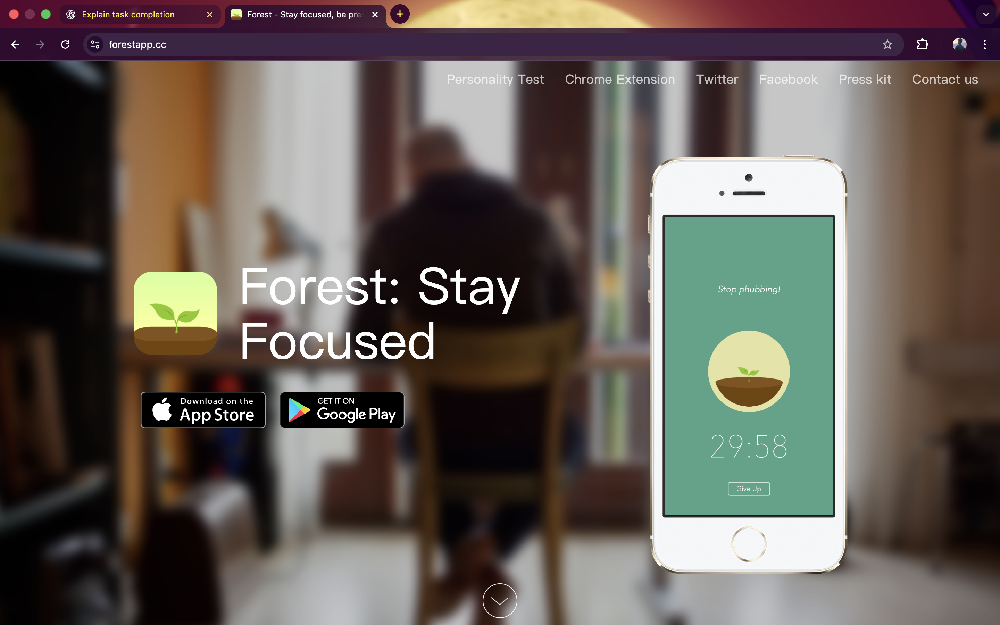

# Competitive Landscape Analysis – Focus Bear

## Overview

To understand Focus Bear’s position in the productivity and focus app market, I compared it with at least one competing app through hands-on exploration. I focused on how features, usability, and overall experience differ from Focus Bear.

---

## Competitor Chosen for Comparison

**Competitor App:** Forest  
**Platform Tested:** Android  
**Reason for Selection:** Forest is a popular focus app commonly used for distraction reduction and productivity.

---

## Features Comparison

### Focus Bear
- Focus sessions combined with habit routines
- App blocking during focus time
- Structured daily routines
- Progress tracking and statistics
- Emphasis on long-term habit building and well-being

### Forest
- Timer-based focus sessions
- Gamified approach (growing a virtual tree)
- Visual motivation rather than structured routines
- Limited habit or routine customization
- Less focus on long-term behavior change

---

## Hands-On Experience & Observations

I explored the Forest app by starting a focus session and navigating through its main screens. The app is visually appealing and motivating, especially due to the gamification aspect. However, it mainly focuses on short-term motivation rather than structured productivity.

In contrast, Focus Bear feels more practical for daily use because it combines focus sessions with routines and app blocking. While Forest motivates users to stay off their phone temporarily, Focus Bear supports consistent behavior change across the day.

---

## Pros and Cons Observed

### Forest – Pros
- Simple and easy to use
- Visually motivating design
- Good for short focus sessions

### Forest – Cons
- Limited customization
- No strong habit-building flow
- Less suitable for long-term productivity routines

### Focus Bear – Strengths
- Strong habit and routine focus
- Better suited for long-term productivity
- More control over distractions
- Clear progress tracking

---

## Screenshot Evidence

The following screenshot shows my hands-on exploration of the competitor app used for comparison.

---

## Personal Reflection

From my personal experience, Focus Bear feels more suitable for users who want to build sustainable habits rather than just temporary focus. While Forest is engaging and fun, Focus Bear offers a more structured and realistic approach to productivity.

This comparison helped me better understand Focus Bear’s competitive advantage and how its features align with users looking for long-term improvement.

---

## Final Conclusion

Focus Bear stands out in the competitive landscape due to its combination of focus, habit-building, and digital well-being. Compared to Forest, it provides deeper functionality and supports consistent daily routines, making it a stronger long-term productivity tool.
