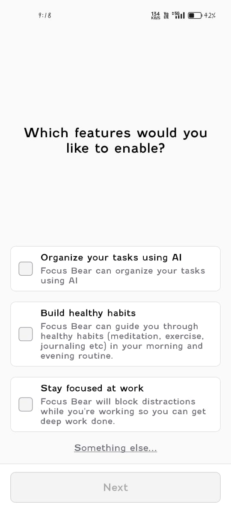
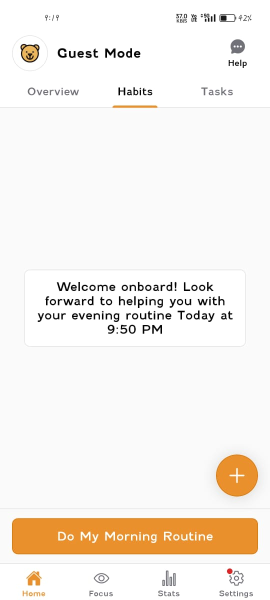
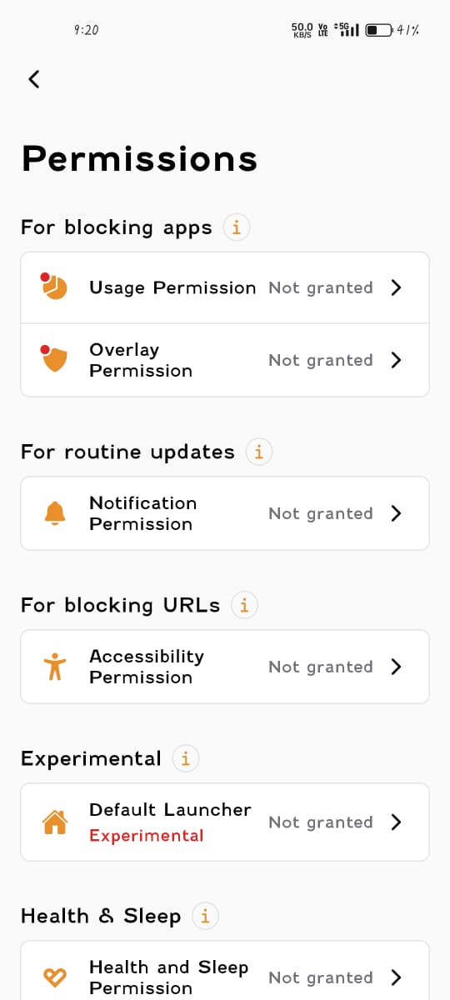

# Focus Bear App – Manual Testing (Android)

**App Name:** Focus Bear: AuDHD routines  
**Platform:** Android  
**App Version:** 1.14.0  
**Test Device:** Realme Narzo 50 Pro (RMX3395)  
**Android Version:** Android 14  
**Testing Type:** Manual Testing  

---

## Overview

This document covers manual testing feedback focused on onboarding and general usability of the Focus Bear Android application. Testing was performed on the latest Android version to identify areas that could be improved for new users.

---

## Screenshots – Onboarding & Usability Issues

### Screenshot 1: Initial Onboarding Screen

**Observation:**  
The onboarding screen introduces the app but does not clearly explain what the user should do first or what the immediate next step is.

**Impact:**  
New users may feel unsure about how to begin using the app effectively.

---

### Screenshot 2: Habit Creation Screen

**Observation:**  
The habit creation screen does not provide examples or short guidance text for first-time users.

**Impact:**  
Users may be confused about how to correctly set up their first habit.

---

### Screenshot 3: Permissions Request Screen

**Observation:**  
Permissions are requested without a brief explanation of why they are required.

**Impact:**  
Users may deny permissions, which can affect reminders and core app functionality.

---

## Improvement Suggestion 1: Clearer Onboarding Instructions

**Description:**  
Adding short explanatory text or prompts during onboarding could help users understand the app’s purpose and how to get started.

**Benefit:**  
Reduces confusion and helps new users quickly understand the app flow.

---

## Improvement Suggestion 2: Guided First-Time Walkthrough

**Description:**  
A short guided walkthrough for first-time users explaining key actions such as creating a habit, setting reminders, and starting a focus session would improve usability.

**Benefit:**  
Helps users understand core features faster and improves early engagement.
