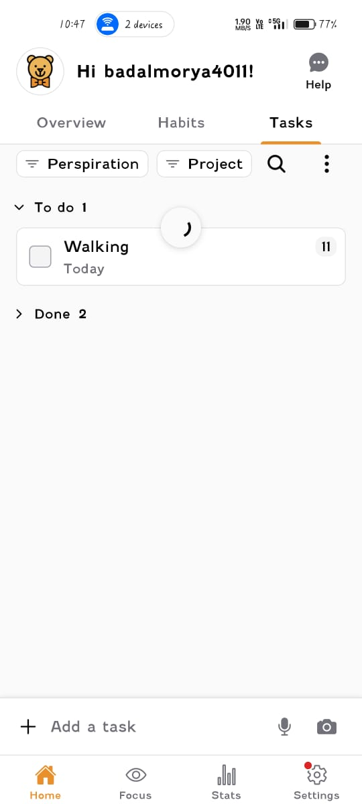

# Internship Time Plan – Badal Moreya

## Overview
This document outlines my current weekly work schedule for the Focus Bear onboarding internship and confirms that I have started using the Focus Bear app to track my work and tasks.

---

## Planned Weekly Work Schedule

I plan to work on onboarding and QA-related tasks during the following days and times:

- **Monday:** 10:00 AM – 12:00 PM  
- **Tuesday:** 10:00 AM – 12:00 PM  
- **Wednesday:** 10:00 AM – 12:00 PM  
- **Thursday:** 10:00 AM – 12:00 PM  
- **Friday:** 10:00 AM – 12:00 PM  

**Total Planned Time:** Approximately 10 hours per week

This schedule allows consistent progress on onboarding tasks while maintaining focus and quality.

---

## Time Tracking in Focus Bear

I have started logging my daily work and tasks using the Focus Bear app. The screenshots included below show active usage of the app, including task tracking and the overview screen during my onboarding work.

---

## Time Tracking Evidence

### Focus Bear – Tasks View

**Details:**
- Screenshot taken from the Tasks tab in Focus Bear  
- Shows an active task scheduled for today  
- Confirms ongoing task tracking using the app  

---

### Focus Bear – Overview Screen

**Details:**
- Screenshot taken from the Overview screen  
- Confirms logged-in user and active Focus Bear usage  
- Shows routines, tasks, and focus context during onboarding work  